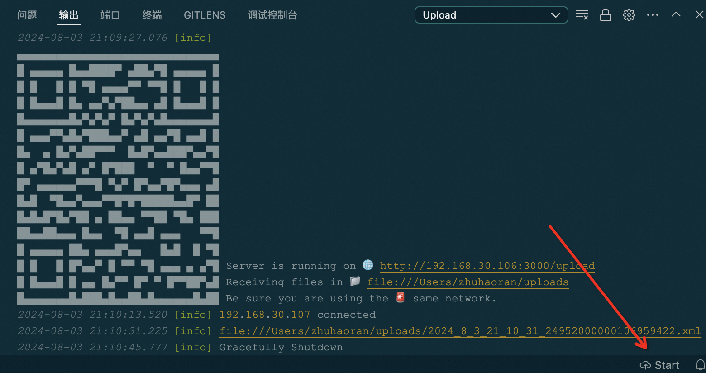

# 文件上传小工具

一个简单而高效的文件上传工具，集成在 VS Code 中，通过扫码唤起手机系统文件选择器的方式，帮助开发者快速上传文件。

## 功能特性

- 支持单个文件上传
- 支持多个文件上传
- 上传进度显示
- 自定义接收文件夹
- ~~大文件分片上传/断点续传/错误重传~~

## 安装

1. 打开 VS Code
2. 转到扩展市场，搜索 ```Free Upload```
3. 点击 **安装** 按钮

## 使用说明

1. 🚨 确认手机与电脑连接 **同一** 网络 / Wi-Fi 🚨
2. 点击下方状态栏右侧的 ```Start``` 按钮，开启上传服务器
3. 使用手机浏览器（或其他可以通过二维码打开网页的APP）扫描输出窗口的二维码
4. 点击Upload按钮
5. 单选或多选文件，点击确定
6. 点击下方状态栏右侧的 ```Stop``` 按钮，关闭上传服务器



## 配置

可以在插件设置中填写你期望的上传地址，留空时默认上传到 ```Home``` 文件夹
